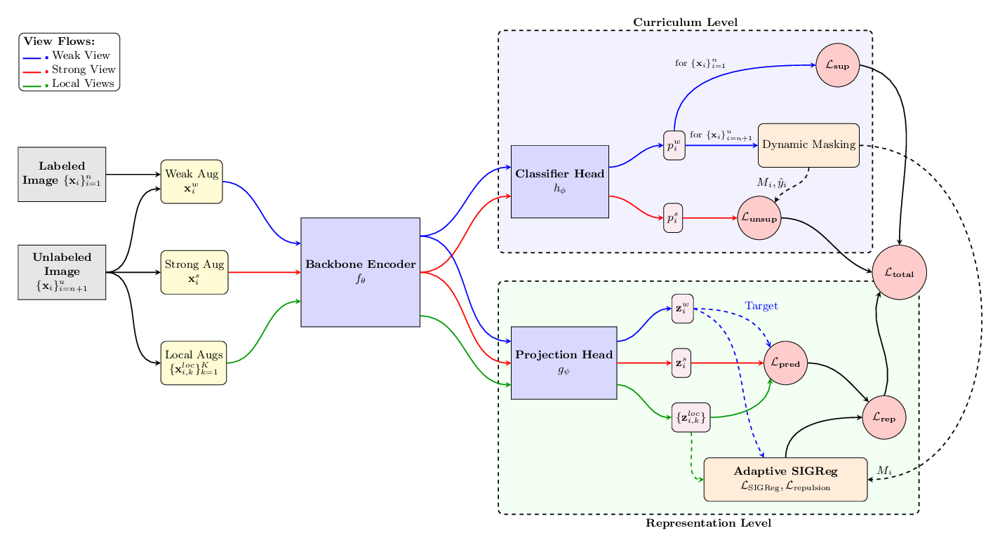
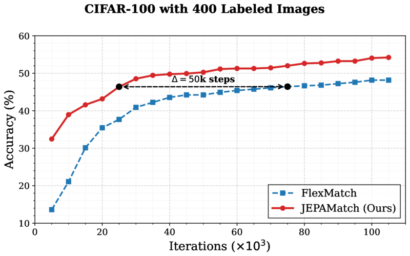
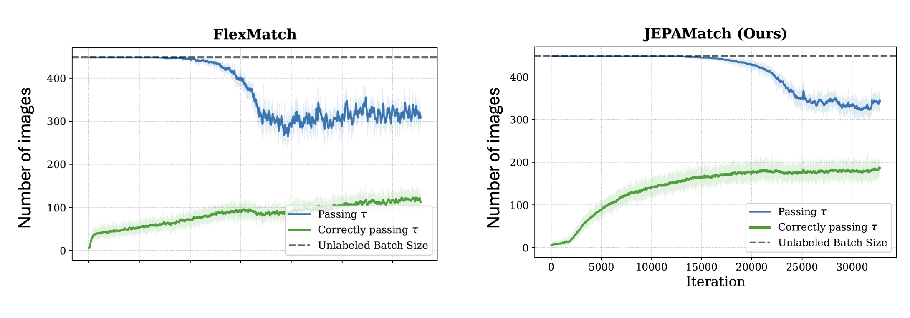

<div align="center">

# JEPAMatch: Geometric Representation Shaping for Semi-Supervised Learning

**Ali Aghababaei-Harandi**, **Aude Sportisse**, **Massih-Reza Amini**
Université Grenoble Alpes, CNRS, Computer Science Laboratory LIG, Grenoble, France

[](https://arxiv.org/abs/2604.21046)
[](LICENSE.txt)

[Paper](https://arxiv.org/abs/2604.21046) • [Configs](config/classic_cv/jepamatch) • [Citation](#citation)

</div>

JEPAMatch combines **FlexMatch**-style adaptive pseudo-labeling with a **LeJEPA**-inspired
representation-level objective: instead of only thresholding softmax outputs, the model also
shapes its latent space into well-separated, isotropic per-class clusters. This fixes two
long-standing FixMatch-family bottlenecks — majority-class dominance in pseudo-labeling, and
the slow convergence tax — cutting the iteration budget by **8×** while matching or beating
prior SSL methods on CIFAR-100, STL-10, and Tiny-ImageNet.

<p align="center">
  
</p>

<p align="center"><sub>
A shared backbone feeds two levels: <b>Curriculum</b> (FlexMatch-style pseudo-labeling on
weak/strong views) and <b>Representation</b> (a JEPA prediction loss between global and local
crops, regularized by <b>Adaptive Class-wise SIGReg</b> with active repulsion between class means).
</sub></p>

- **8× fewer iterations to converge** to FlexMatch's final accuracy.
- **State-of-the-art or competitive** on CIFAR-100, STL-10, and Tiny-ImageNet.
- **Drop-in module** on top of FlexMatch, FreeMatch, or SoftMatch's curriculum, and more robust
  under class imbalance.
- Built on the [USB](https://github.com/microsoft/Semi-supervised-learning) benchmark, so every
  other baseline (FixMatch, FlexMatch, FreeMatch, SoftMatch, CoMatch, SimMatch, ...) ships
  alongside it, sharing the same data pipelines.

## Results

Error rate (%), lower is better, 3 seeds.

| Method | Iter. | CIFAR-100 (400) | CIFAR-100 (2.5K) | CIFAR-100 (10K) | STL-10 (40) | STL-10 (1K) |
|---|:-:|:-:|:-:|:-:|:-:|:-:|
| FixMatch | 2²⁰ | 46.42 ± 0.82 | 28.03 ± 0.16 | 22.20 ± 0.12 | 35.97 ± 4.14 | 6.25 ± 0.33 |
| FlexMatch | 2²⁰ | 39.94 ± 1.62 | 26.49 ± 0.20 | 21.90 ± 0.15 | 29.15 ± 4.16 | 5.77 ± 0.18 |
| FreeMatch | 2²⁰ | 37.98 ± 0.42 | 26.47 ± 0.20 | 21.68 ± 0.03 | 15.56 ± 0.55 | 5.63 ± 0.15 |
| SoftMatch | 2²⁰ | 37.10 ± 0.77 | 26.66 ± 0.25 | 22.03 ± 0.03 | 21.42 ± 3.48 | 5.73 ± 0.24 |
| SimMatch | 2²⁰ | 37.81 ± 2.21 | 25.07 ± 0.32 | 20.58 ± 0.11 | -- | -- |
| RegMixMatch* | 2²⁰ | 35.27 | 23.78 | 19.41 | **11.74** | 4.66 |
| **JEPAMatch (Ours)** | **2¹⁷** | **34.25 ± 1.97** | **22.59 ± 1.17** | 18.55 ± 0.85 | 13.44 ± 3.2 | **4.28 ± 1.43** |

<sub>*std. dev. not reported in the original paper. Full baseline table (incl. CrMatch, FlatMatch,
Suave, PseudoLabel, MeanTeacher, MixMatch, ReMixMatch, UDA) in the paper.</sub>

<details>
<summary>Tiny-ImageNet, class imbalance, and drop-in-module results</summary>

**Tiny-ImageNet** (error rate %)

| Method | Iter. | 1K labels | 10K labels |
|---|:-:|:-:|:-:|
| FlexMatch | 2¹⁸ | 41.73 | 27.89 |
| SoftMatch | 2¹⁸ | 40.09 | 25.92 |
| **JEPAMatch** | 2¹⁸ | **38.82** | **24.50** |

**Class imbalance** (CIFAR-100, 4 labels/class, imbalance ratio γ) &nbsp;&nbsp; **As a drop-in module** (same setting)

<table>
<tr><td valign="top">

| Method | γ=20 | γ=50 | γ=100 |
|---|:-:|:-:|:-:|
| FixMatch | 50.42 ± 0.78 | 57.89 ± 0.33 | 62.40 ± 0.48 |
| FlexMatch | 49.11 ± 0.60 | 57.20 ± 0.39 | 62.70 ± 0.47 |
| SoftMatch | 48.09 ± 0.55 | 56.24 ± 0.51 | 61.08 ± 0.81 |
| **JEPAMatch** | **46.27 ± 0.94** | **55.16 ± 1.12** | **59.93 ± 0.68** |

</td><td valign="top">

| Method | Iter. | Error |
|---|:-:|:-:|
| FlexMatch | 2²⁰ | 50.15 ± 1.51 |
| FreeMatch | 2²⁰ | 49.64 ± 1.46 |
| SoftMatch | 2²⁰ | 49.24 ± 2.16 |
| **JEPAMatch (Flex/Free/Soft)** | 2¹⁷ | **45.77 / 45.12 / 44.65** |

</td></tr>
</table>

</details>

<p align="center">
  
  
</p>

<p align="center"><sub>
JEPAMatch reaches FlexMatch's peak accuracy (CIFAR-100, 4 labels/class) ~50k iterations earlier,
by using all unlabeled data from step 1 and keeping pseudo-labels more class-balanced
(<a href="assets/max_class_count.png">figure</a>) throughout training.
</sub></p>

## Method, in short

- **Curriculum level** — unchanged FlexMatch: a weak view produces a pseudo-label, gated by a
  per-class dynamic confidence threshold; a strong view is trained toward it when confident.
- **Representation level** — a projection head predicts a target embedding from local crops
  (optionally the global views too), regularized by **Adaptive Class-wise SIGReg**: isotropic
  SIGReg during warmup, then per-class centering, variance annealing, and active repulsion
  between class means once pseudo-labels are reliable.

Full derivation and loss equations are in the [paper](https://arxiv.org/abs/2604.21046). Code:
[`semilearn/algorithms/jepamatch/`](semilearn/algorithms/jepamatch) (curriculum + representation
loss) and [`semilearn/nets/jepa_modules.py`](semilearn/nets/jepa_modules.py) (projection head,
SIGReg).

## Quick start

```bash
git clone https://github.com/aah94/JEPAMatch.git
cd JEPAMatch
pip install -r requirements.txt

# CIFAR-100, 400 labels, WRN-28-8 (the paper's main configuration)
python train.py --c config/classic_cv/jepamatch/jepamatch_cifar100_400_0.yaml
```

Requires Python ≥ 3.8 and PyTorch ≥ 1.12 with CUDA (GPU-only, no CPU fallback). Every scenario in
the paper has a ready-made config under [`config/classic_cv/jepamatch/`](config/classic_cv/jepamatch):

| Dataset | Label counts | Backbone |
|---|---|---|
| CIFAR-100 | 400, 2500, 10000 | `wrn_28_8` |
| STL-10 | 40, 250, 1000 | `wrn_var_37_2` |
| CIFAR-10 | 40, 250, 4000 | `wrn_28_2` |
| SVHN | 40, 250, 1000 | `wrn_28_2` |

(CIFAR-10 and SVHN aren't paper benchmarks — their hyperparameters follow the CIFAR-100 setting
as the closest analog and aren't independently tuned.)

```bash
# evaluate a checkpoint
python eval.py --c config/classic_cv/jepamatch/jepamatch_cifar100_400_0.yaml \
                --load_path saved_models/classic_cv/jepamatch_cifar100_400_0/model_best.pth
```

## Configuration

On top of the standard USB training config, JEPAMatch configs add:

```yaml
beta: 0.2               # SIGReg balance within the representation loss
lambda_rep: 0.5          # representation loss weight in the total loss
repulsion_coef: 1000     # extra weight on the repulsion term -- see note below
warmup_ratio: 0.25       # fraction of training spent in the SIGReg warmup phase
centroid_mean: local     # JEPA prediction target: local crops, or global (weak+strong) views
sigreg_views: local      # SIGReg scope: local crops only, or all views
num_local: 6             # number of local crops, local_size / scale_l control their geometry
```

`centroid_mean=local, sigreg_views=local` (the defaults) produced every number above; the other
settings are ablations (`sigreg_views=all` is closer to vanilla LeJEPA).

**On `repulsion_coef`:** the paper's equation writes this term with an implicit coefficient of
1.0, but at that scale it's numerically negligible next to the other two terms, so every reported
result was actually trained with a 1000× multiplier — disclosed here rather than hidden. Set it
to `1.0` to match the paper's written formula exactly, at the cost of weaker class-mean separation.

## Citation

```bibtex
@article{aghababaeiharandi2026jepamatch,
  title   = {{JEPAMatch}: Geometric Representation Shaping for Semi-Supervised Learning},
  author  = {Aghababaei-Harandi, Ali and Sportisse, Aude and Amini, Massih-Reza},
  journal = {arXiv preprint arXiv:2604.21046},
  year    = {2026}
}
```

Builds directly on [LeJEPA](https://arxiv.org/abs/2511.08544) (Balestriero & LeCun, 2025),
[FlexMatch](https://arxiv.org/abs/2110.08263) (Zhang et al., NeurIPS 2021), and
[USB](https://arxiv.org/abs/2208.07204) (Wang et al., NeurIPS 2022) — this repository's base
codebase, from which every other algorithm ships unmodified alongside JEPAMatch.

## License

MIT — see [LICENSE.txt](LICENSE.txt). Derived from Microsoft's USB benchmark (MIT-licensed);
JEPAMatch-specific code is licensed the same way.
