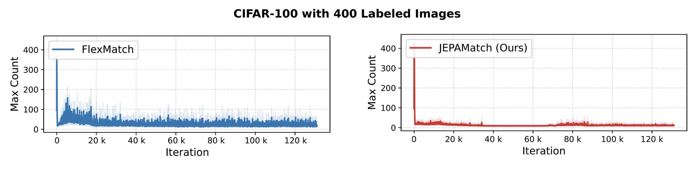

<div align="center">

# JEPAMatch: Geometric Representation Shaping for Semi-Supervised Learning

**Ali Aghababaei-Harandi**, **Aude Sportisse**, **Massih-Reza Amini**
Université Grenoble Alpes, CNRS, Computer Science Laboratory LIG, Grenoble, France

[](https://arxiv.org/abs/2604.21046)
[](LICENSE.txt)
[](requirements.txt)
[](requirements.txt)

[Paper (arXiv)](https://arxiv.org/abs/2604.21046) • [Config Files](config/classic_cv/jepamatch) • [Citation](#citation)

</div>

---

JEPAMatch combines **FlexMatch**-style adaptive pseudo-labeling with a **LeJEPA**-inspired
representation-level objective, so that instead of only thresholding softmax outputs, the model
also explicitly shapes its latent space into well-separated, isotropic per-class clusters. This
fixes two long-standing FixMatch-family bottlenecks — majority-class dominance in pseudo-labeling,
and the ~2²⁰-iteration convergence tax — cutting the iteration budget by **8×** while matching or
beating prior SSL methods on CIFAR-100, STL-10, and Tiny-ImageNet.

<p align="center">
  
</p>

<p align="center"><em>
A shared backbone feeds two levels: the <b>Curriculum Level</b> (top) does FlexMatch-style
adaptive pseudo-labeling on weak/strong views; the <b>Representation Level</b> (bottom) aligns
global and local crops via a JEPA prediction loss, regularized by <b>Adaptive Class-wise SIGReg</b>
— per-class isotropic Gaussians instead of one global one, kept apart by an active repulsion term.
</em></p>

## Highlights

- **8× fewer iterations to converge.** JEPAMatch reaches FlexMatch's final CIFAR-100 (400-label)
  accuracy roughly 50k steps earlier, and finishes training at 2¹⁷ iterations vs. the standard 2²⁰.
- **State-of-the-art or competitive results** on CIFAR-100, STL-10, and Tiny-ImageNet against
  FixMatch, FlexMatch, FreeMatch, SoftMatch, CrMatch, SimMatch, Suave, and RegMixMatch.
- **More robust under class imbalance**, and **works as a drop-in module** on top of FlexMatch,
  FreeMatch, or SoftMatch's curriculum (see [Results](#results)).
- Built on the [USB](https://github.com/microsoft/Semi-supervised-learning) benchmark codebase, so
  every other SSL baseline in this repo (FixMatch, FlexMatch, FreeMatch, SoftMatch, CoMatch,
  SimMatch, ...) is available and directly comparable, dataset loaders included.

## Results

### CIFAR-100 & STL-10 (error rate %, lower is better, 3 seeds)

| Method | Iter. | CIFAR-100 (400) | CIFAR-100 (2.5K) | CIFAR-100 (10K) | STL-10 (40) | STL-10 (1K) |
|---|:-:|:-:|:-:|:-:|:-:|:-:|
| FixMatch | 2²⁰ | 46.42 ± 0.82 | 28.03 ± 0.16 | 22.20 ± 0.12 | 35.97 ± 4.14 | 6.25 ± 0.33 |
| FlexMatch | 2²⁰ | 39.94 ± 1.62 | 26.49 ± 0.20 | 21.90 ± 0.15 | 29.15 ± 4.16 | 5.77 ± 0.18 |
| FreeMatch | 2²⁰ | 37.98 ± 0.42 | 26.47 ± 0.20 | 21.68 ± 0.03 | 15.56 ± 0.55 | 5.63 ± 0.15 |
| SoftMatch | 2²⁰ | 37.10 ± 0.77 | 26.66 ± 0.25 | 22.03 ± 0.03 | 21.42 ± 3.48 | 5.73 ± 0.24 |
| CrMatch | 2²⁰ | 39.45 ± 1.69 | 25.43 ± 0.14 | 20.40 ± 0.08 | -- | 4.89 ± 0.17 |
| SimMatch | 2²⁰ | 37.81 ± 2.21 | 25.07 ± 0.32 | 20.58 ± 0.11 | -- | -- |
| FlatMatch | 2²⁰ | 38.76 ± 1.62 | 25.38 ± 0.85 | 19.01 ± 0.43 | 16.20 ± 4.34 | 4.82 ± 1.21 |
| Suave* | 2²⁰ | 35.40 | 23.00 | **18.40** | -- | -- |
| RegMixMatch* | 2²⁰ | 35.27 | 23.78 | 19.41 | **11.74** | 4.66 |
| **JEPAMatch (Ours)** | **2¹⁷** | **34.25 ± 1.97** | **22.59 ± 1.17** | 18.55 ± 0.85 | 13.44 ± 3.2 | **4.28 ± 1.43** |

*standard deviation not reported in the original paper. See the paper for the full baseline table
(PseudoLabel, MeanTeacher, MixMatch, ReMixMatch, UDA).

### Tiny-ImageNet (error rate %)

| Method | Iter. | 1K labels | 10K labels |
|---|:-:|:-:|:-:|
| FlexMatch | 2¹⁸ | 41.73 | 27.89 |
| SoftMatch | 2¹⁸ | 40.09 | 25.92 |
| **JEPAMatch** | 2¹⁸ | **38.82** | **24.50** |

### Robustness to class imbalance, and as a drop-in module (CIFAR-100, 4 labels/class)

<table>
<tr><td valign="top">

| Method | γ=20 | γ=50 | γ=100 |
|---|:-:|:-:|:-:|
| FixMatch | 50.42 ± 0.78 | 57.89 ± 0.33 | 62.40 ± 0.48 |
| FlexMatch | 49.11 ± 0.60 | 57.20 ± 0.39 | 62.70 ± 0.47 |
| SoftMatch | 48.09 ± 0.55 | 56.24 ± 0.51 | 61.08 ± 0.81 |
| **JEPAMatch** | **46.27 ± 0.94** | **55.16 ± 1.12** | **59.93 ± 0.68** |

</td><td valign="top">

| Method | Iter. | Error |
|---|:-:|:-:|
| FlexMatch | 2²⁰ | 50.15 ± 1.51 |
| FreeMatch | 2²⁰ | 49.64 ± 1.46 |
| SoftMatch | 2²⁰ | 49.24 ± 2.16 |
| **JEPAMatch (Flex)** | 2¹⁷ | **45.77 ± 2.77** |
| **JEPAMatch (Free)** | 2¹⁷ | **45.12 ± 1.98** |
| **JEPAMatch (Soft)** | 2¹⁷ | **44.65 ± 2.14** |

</td></tr>
</table>

*Left: imbalance robustness at three imbalance ratios γ. Right: JEPAMatch's representation loss
added on top of three different curriculum methods — the gain is consistent regardless of which
pseudo-label thresholding rule is used underneath.*

### Convergence speed & pseudo-labeling quality

<p align="center">
  
</p>

JEPAMatch reaches FlexMatch's peak accuracy (CIFAR-100, 4 labels/class) roughly **50k iterations
earlier**, and keeps climbing to a substantially higher final accuracy — using all unlabeled data
from iteration 1 instead of gradually admitting it as confidence rises.

<p align="center">
  
  
</p>

*Left: JEPAMatch keeps more pseudo-labels above the confidence threshold, at higher correctness,
than FlexMatch. Right: FlexMatch's majority class can claim up to a quarter of all pseudo-labels
in a batch; JEPAMatch's Adaptive Class-wise SIGReg keeps this far more balanced throughout
training.*

## Method, in short

- **Curriculum Level** — unchanged FlexMatch: a weak view produces a pseudo-label and a per-class
  dynamic confidence threshold gates it; a strong view is trained toward that pseudo-label when
  confident. See [`semilearn/algorithms/jepamatch/jepamatch.py`](semilearn/algorithms/jepamatch/jepamatch.py).
- **Representation Level** — a projection head predicts a target-view embedding from local crops
  (and optionally the global views), regularized by **Adaptive Class-wise SIGReg**: a warmup phase
  applies plain isotropic-Gaussian SIGReg (à la [LeJEPA](https://arxiv.org/abs/2511.08544)) so the
  space doesn't collapse before pseudo-labels are reliable; a main phase then centers each
  confident sample on its class mean, anneals the target variance down, and applies an **active
  repulsion loss** between class means so classes don't collapse together. See
  [`semilearn/nets/jepa_modules.py`](semilearn/nets/jepa_modules.py).
- Two design axes are independently configurable — `centroid_mean` (prediction target: local crops
  vs. global views) and `sigreg_views` (SIGReg scope: local crops only vs. all views) — since the
  paper's design deliberately diverges from vanilla LeJEPA on both. See
  [Configuration](#configuration) below.

Full derivation, all loss equations, and the complete related-work discussion are in the
[paper](https://arxiv.org/abs/2604.21046).

## Installation

```bash
git clone https://github.com/aah94/JEPAMatch.git
cd JEPAMatch
pip install -r requirements.txt
```

Requires Python ≥ 3.8 and PyTorch ≥ 1.12 with CUDA (training is GPU-only — there is no CPU
fallback path).

## Quick start

```bash
# CIFAR-100, 400 labels, WRN-28-8 (the paper's main configuration)
python train.py --c config/classic_cv/jepamatch/jepamatch_cifar100_400_0.yaml
```

Every scenario in the paper's tables has a ready-made config under
[`config/classic_cv/jepamatch/`](config/classic_cv/jepamatch):

| Dataset | Label counts | Backbone |
|---|---|---|
| CIFAR-100 | 400, 2500, 10000 | `wrn_28_8` |
| STL-10 | 40, 250, 1000 | `wrn_var_37_2` |
| CIFAR-10 | 40, 250, 4000 | `wrn_28_2` |
| SVHN | 40, 250, 1000 | `wrn_28_2` |

(CIFAR-10 and SVHN are not paper benchmarks — their JEPAMatch hyperparameters follow the CIFAR-100
setting as the closest analog and aren't independently tuned.)

Evaluate a checkpoint:

```bash
python eval.py --c config/classic_cv/jepamatch/jepamatch_cifar100_400_0.yaml \
                --load_path saved_models/classic_cv/jepamatch_cifar100_400_0/model_best.pth
```

## Configuration

Beyond the standard USB training config (optimizer, schedule, backbone, ...), JEPAMatch configs add:

```yaml
# Representation Level hyperparameters
beta: 0.2                # SIGReg balance within the representation loss
lambda_rep: 0.5           # representation loss weight in the total loss
warmup_ratio: 0.25        # fraction of training spent in the SIGReg warmup phase (T_warm / T)
centroid_mean: local      # JEPA prediction target: "local" (K local crops) or "global" (weak+strong)
sigreg_views: local       # SIGReg scope: "local" crops only, or "all" views (weak+strong+local)
save_train_info: True     # dump per-step pseudo-labeling diagnostics (reproduces the analysis figures)

# Multi-view augmentation
num_local: 6              # K local crops
local_size: 20            # local crop pixel size
scale_l: [0.2, 0.5]       # local crop area range
```

`centroid_mean=local, sigreg_views=local` (the defaults) are what produced every number in the
tables above. The other combinations exist for ablations — e.g. `sigreg_views=all` applies SIGReg
to every view (closer to vanilla LeJEPA), and `weak_strong_source`/`global_source` (CIFAR
loader only, see [`semilearn/datasets/cv_datasets/cifar.py`](semilearn/datasets/cv_datasets/cifar.py))
let you swap the weak/strong augmentation recipe or fully decouple the representation loss's
"global" views from the ones used for pseudo-labeling.

## Repository structure

```
semilearn/algorithms/jepamatch/   JEPAMatch algorithm (curriculum + representation loss)
semilearn/nets/jepa_modules.py    Projection head, SIGReg, Adaptive Class-wise SIGReg
semilearn/datasets/               CIFAR-100/STL-10/CIFAR-10/SVHN/Tiny-ImageNet loaders,
                                   multi-view (local/global) augmentation
config/classic_cv/jepamatch/      One yaml per paper scenario (dataset x label count)
preprocess/preprocess_tiny_imagenet.py   Reorganizes the official Tiny-ImageNet-200 download
                                   into the ImageFolder layout semilearn expects
train.py, eval.py                 Entry points (inherited from USB)
```

This repository is a fork of Microsoft's [USB: Unified Semi-supervised learning
Benchmark](https://github.com/microsoft/Semi-supervised-learning) — every other algorithm
(FixMatch, FlexMatch, FreeMatch, SoftMatch, CoMatch, SimMatch, ...) ships unmodified alongside
JEPAMatch, sharing the same data pipelines and training loop.

## Status

This repository tracks ongoing development. The configs and numbers above reproduce the paper;
if a design ablation turns up a better default, this README and the configs will be updated
accordingly — check the commit history for what changed and why.

## Citation

If you use this code, please cite:

```bibtex
@article{aghababaeiharandi2026jepamatch,
  title   = {{JEPAMatch}: Geometric Representation Shaping for Semi-Supervised Learning},
  author  = {Aghababaei-Harandi, Ali and Sportisse, Aude and Amini, Massih-Reza},
  journal = {arXiv preprint arXiv:2604.21046},
  year    = {2026}
}
```

This work builds directly on:
- **LeJEPA** — Balestriero \& LeCun, [*Provable and Scalable Self-Supervised Learning Without the
  Heuristics*](https://arxiv.org/abs/2511.08544), 2025.
- **FlexMatch** — Zhang et al., [*Boosting Semi-Supervised Learning via Curriculum Pseudo
  Labeling*](https://arxiv.org/abs/2110.08263), NeurIPS 2021.
- **USB** — Wang et al., [*USB: A Unified Semi-supervised Learning Benchmark for Classification*](https://arxiv.org/abs/2208.07204),
  NeurIPS 2022 (this repository's base codebase).

## License

MIT — see [LICENSE.txt](LICENSE.txt). This repository derives from Microsoft's USB benchmark
(MIT-licensed); JEPAMatch-specific code is licensed the same way.
